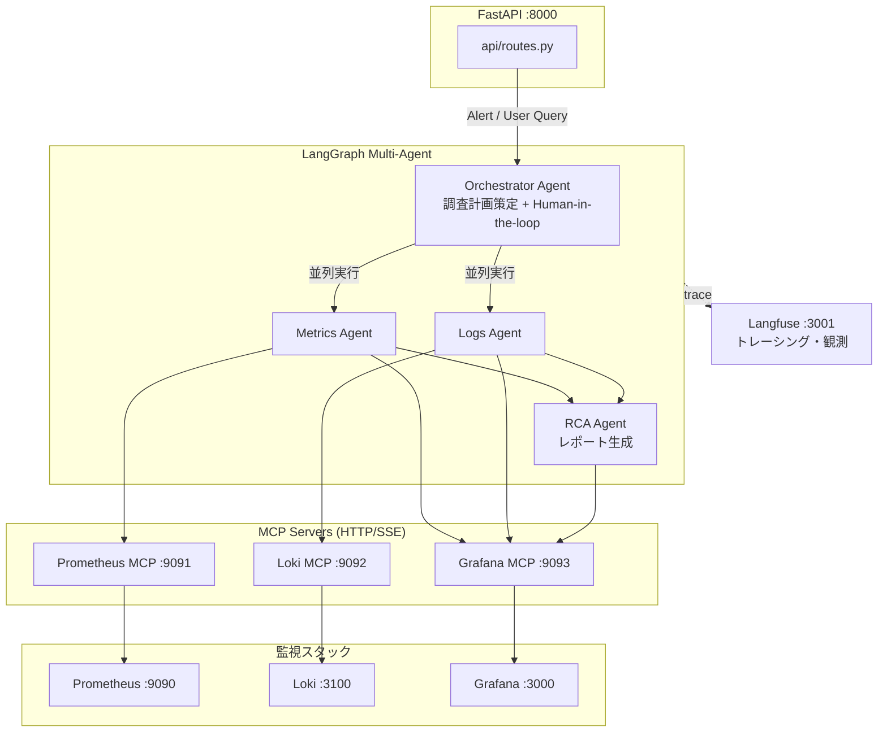
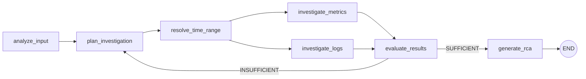

# アーキテクチャ概要

## システム全体像

本システムは、LangGraph ベースの Multi-Agent ワークフローによりシステム監視を自律的に行う。
Prometheus / Loki / Grafana の監視スタックから MCP (Model Context Protocol) サーバ経由でデータを取得し、
LLM が異常の調査・根本原因分析 (RCA) レポートを生成する。



## Agent ワークフロー



1. **analyze_input** — アラートまたはユーザクエリの内容を LLM が分析
2. **plan_investigation** — PromQL / LogQL クエリと対象インスタンスを含む調査計画を策定
3. **resolve_time_range** — 時間範囲の確定 (Alert 時刻から自動推定 / ユーザ入力 / interrupt)
4. **investigate_metrics** / **investigate_logs** — 並列に MCP 経由でデータ取得・分析
5. **evaluate_results** — 結果が十分か判定。不十分なら再計画 (最大 `max_iterations` 回)
6. **generate_rca** — 根本原因分析レポートを生成

## ディレクトリ構成

```
ai-agent-observability/
├── src/ai_agent_monitoring/
│   ├── agents/          # LangGraph Agent 群
│   │   ├── orchestrator.py   # 全体制御
│   │   ├── metrics_agent.py  # Prometheus メトリクス調査
│   │   ├── logs_agent.py     # Loki ログ調査
│   │   ├── rca_agent.py      # RCA レポート生成
│   │   └── prompts.py        # システムプロンプト定義
│   ├── api/             # FastAPI REST API
│   │   ├── main.py           # アプリケーション起動
│   │   ├── routes.py         # エンドポイント定義
│   │   ├── schemas.py        # リクエスト/レスポンス型
│   │   └── dependencies.py   # DI (LLM, MCP クライアント)
│   ├── core/            # 共有モジュール
│   │   ├── config.py         # Pydantic Settings (環境変数)
│   │   ├── models.py         # ドメインモデル (Alert, RCAReport 等)
│   │   ├── state.py          # AgentState (LangGraph TypedDict)
│   │   ├── tracing.py        # Langfuse トレーシング
│   │   └── renderer.py       # レポートレンダラー
│   ├── tools/           # MCP ツール
│   │   ├── base.py           # MCPClient 基底クラス
│   │   ├── prometheus.py     # Prometheus MCP ツール
│   │   ├── loki.py           # Loki MCP ツール
│   │   ├── grafana.py        # Grafana MCP ツール
│   │   └── registry.py       # ツールレジストリ
│   └── mcp/             # (将来拡張用)
├── deploy/              # インフラ設定
│   ├── grafana/              # ダッシュボード & データソース
│   ├── loki/                 # Loki 設定
│   ├── loki-mcp/             # Loki MCP Dockerfile
│   ├── prometheus/           # Prometheus & アラートルール
│   └── promtail/             # Promtail 設定
├── tests/               # テスト
├── docker-compose.yaml  # 17+ サービス定義
├── Makefile             # 開発・テスト用コマンド
└── pyproject.toml       # プロジェクト設定
```

## 技術スタック

| カテゴリ | 技術 |
|----------|------|
| Agent フレームワーク | LangGraph, LangChain |
| LLM | Ollama (qwen2.5:0.5b) ※OpenAI 互換 API |
| API | FastAPI, Uvicorn |
| メトリクス | Prometheus |
| ログ | Loki, Promtail |
| 可視化 | Grafana |
| MCP サーバ | prometheus-mcp-server, loki-mcp, grafana-mcp |
| トレーシング | Langfuse (self-hosted) |
| 型検査 / Lint | mypy (strict), Ruff |
| テスト | pytest, pytest-asyncio |
| パッケージ管理 | uv |
