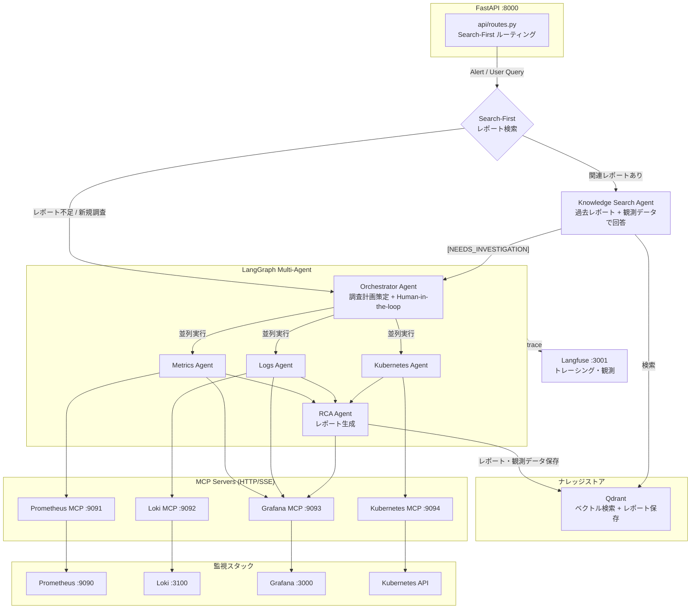
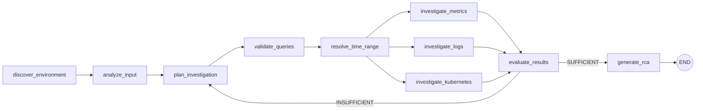

# アーキテクチャ概要

## システム全体像

本システムは、LangGraph ベースの Multi-Agent ワークフローによりシステム監視を自律的に行う。
Prometheus / Loki / Grafana の監視スタックから MCP (Model Context Protocol) サーバ経由でデータを取得し、
LLM が異常の調査・根本原因分析 (RCA) レポートを生成する。


```mermaid
graph TD
    subgraph API["FastAPI :8000"]
        routes["api/routes.py<br/>Search-First ルーティング"]
    end

    routes -->|"Alert / User Query"| search_first
    search_first{"Search-First<br/>レポート検索"}
    search_first -->|"関連レポートあり"| knowledge["Knowledge Search Agent<br/>過去レポート + 観測データで回答"]
    search_first -->|"レポート不足 / 新規調査"| orchestrator
    knowledge -->|"[NEEDS_INVESTIGATION]"| orchestrator

    subgraph Agents["LangGraph Multi-Agent"]
        orchestrator["Orchestrator Agent<br/>調査計画策定 + Human-in-the-loop"]
        metrics["Metrics Agent"]
        logs["Logs Agent"]
        k8s["Kubernetes Agent"]
        rca["RCA Agent<br/>レポート生成"]

        orchestrator -->|並列実行| metrics
        orchestrator -->|並列実行| logs
        orchestrator -->|並列実行| k8s
        metrics --> rca
        logs --> rca
        k8s --> rca
    end

    subgraph Storage["ナレッジストア"]
        qdrant["Qdrant<br/>ベクトル検索 + レポート保存"]
    end

    rca -->|レポート・観測データ保存| qdrant
    knowledge -->|検索| qdrant

    subgraph MCP["MCP Servers (HTTP/SSE)"]
        prom_mcp["Prometheus MCP :9091"]
        loki_mcp["Loki MCP :9092"]
        grafana_mcp["Grafana MCP :9093"]
        k8s_mcp["Kubernetes MCP :9094"]
    end

    metrics --> prom_mcp
    metrics --> grafana_mcp
    logs --> loki_mcp
    logs --> grafana_mcp
    k8s --> k8s_mcp
    rca --> grafana_mcp

    subgraph Infra["監視スタック"]
        prometheus["Prometheus :9090"]
        loki["Loki :3100"]
        grafana["Grafana :3000"]
        k8s_api["Kubernetes API"]
    end

    prom_mcp --> prometheus
    loki_mcp --> loki
    grafana_mcp --> grafana
    k8s_mcp --> k8s_api

    langfuse["Langfuse :3001<br/>トレーシング・観測"]
    Agents -.->|trace| langfuse
```

## リクエストフロー (Search-First)

ユーザクエリの受付時、まず過去のナレッジを検索してから調査を判断する:

1. **retry パターン検出** — 「再調査」「やり直し」等は既存調査の継続・再実行にルーティング
2. **レポート検索** — Qdrant ベクトル検索で関連レポートを探す
3. **スコア閾値判定** — 関連レポートのスコアが閾値を超えれば KnowledgeSearchAgent が回答を生成
4. **自動調査フォールバック** — 回答に `[NEEDS_INVESTIGATION]` マーカーが含まれる場合、部分回答を保持しつつ自動的に新規調査を開始
5. **新規調査** — 関連レポートがない場合は Orchestrator Agent による調査を開始

## Agent ワークフロー (Orchestrator)


```mermaid
graph LR
    Z[discover_environment] --> A[analyze_input]
    A --> B[plan_investigation]
    B --> V[validate_queries]
    V --> C[resolve_time_range]
    C --> D[investigate_metrics]
    C --> E[investigate_logs]
    C --> K[investigate_kubernetes]
    D --> F[evaluate_results]
    E --> F
    K --> F
    F -->|INSUFFICIENT| B
    F -->|SUFFICIENT| G[generate_rca]
    G --> H((END))
```

1. **discover_environment** — Grafana MCP 経由でデータソース一覧・ダッシュボード・メトリクス/ラベル情報を取得し、環境コンテキストを構築。データソースの自動選択とプリファレンス管理を行う
2. **analyze_input** — アラートまたはユーザクエリの内容を LLM が分析。ObservationStore から過去の類似観測データを取得し、分析のコンテキストに含める
3. **plan_investigation** — PromQL / LogQL クエリと対象インスタンスを含む調査計画を策定 (LLM Structured Output)
4. **validate_queries** — 生成されたクエリを QueryValidator でバリデーション。Query RAG で Few-shot 例を参照し、構文エラーを事前に検出・修正
5. **resolve_time_range** — 時間範囲の確定 (Alert 時刻から自動推定 / クエリテキストから解析 / デフォルト値)
6. **investigate_metrics** / **investigate_logs** / **investigate_kubernetes** — 並列に MCP 経由でデータ取得・分析 (ReAct ループ)
7. **evaluate_results** — 結果が十分か判定。不十分なら再計画 (最大 `max_iterations` 回)
8. **generate_rca** — 根本原因分析レポートを生成。完了後、ObservationStore にエージェント観測データを保存、Qdrant にレポートを保存

## ディレクトリ構成

```
ai-agent-observability/
├── src/ai_agent_monitoring/
│   ├── agents/          # LangGraph Agent 群
│   │   ├── orchestrator.py        # 全体制御 (Orchestrator Agent)
│   │   ├── metrics_agent.py       # Prometheus メトリクス調査
│   │   ├── logs_agent.py          # Loki ログ調査
│   │   ├── kubernetes_agent.py    # K8s クラスタ状態調査
│   │   ├── rca_agent.py           # RCA レポート生成
│   │   ├── knowledge_search_agent.py  # ナレッジ検索 (レポート + 観測データ)
│   │   └── prompts.py             # システムプロンプト定義
│   ├── api/             # FastAPI REST API
│   │   ├── main.py           # アプリケーション起動
│   │   ├── routes.py         # エンドポイント定義 (Search-First ルーティング)
│   │   ├── schemas.py        # リクエスト/レスポンス型
│   │   └── dependencies.py   # DI (LLM, MCP クライアント)
│   ├── core/            # 共有モジュール
│   │   ├── config.py         # Pydantic Settings (環境変数)
│   │   ├── models.py         # ドメインモデル (Alert, RCAReport 等)
│   │   ├── state.py          # AgentState (LangGraph TypedDict)
│   │   ├── tracing.py        # Langfuse トレーシング
│   │   ├── renderer.py       # レポートレンダラー
│   │   ├── observation_store.py  # 観測データストア (Qdrant ベクトル検索)
│   │   ├── vector_store.py   # ベクトルストア基盤 (Qdrant, レポート保存・検索)
│   │   ├── datasource.py     # データソース自動選択 + プリファレンス管理
│   │   ├── json_repair.py    # LLM 出力の JSON 修復
│   │   ├── llm_retry.py      # LLM リトライ
│   │   └── sanitizer.py      # ユーザ入力サニタイザー
│   ├── tools/           # MCP ツール
│   │   ├── base.py           # MCPClient 基底クラス
│   │   ├── prometheus.py     # Prometheus MCP ツール
│   │   ├── loki.py           # Loki MCP ツール
│   │   ├── grafana.py        # Grafana MCP ツール
│   │   ├── kubernetes.py     # Kubernetes MCP ツール
│   │   ├── registry.py       # ツールレジストリ
│   │   ├── query_validator.py  # PromQL/LogQL バリデータ
│   │   ├── query_rag.py      # クエリ Few-shot RAG (BM25)
│   │   └── time.py           # 時間関連ツール
│   └── mcp/             # (将来拡張用)
├── integration/         # 外部UI統合
│   └── pipe_function.py      # Open WebUI Pipe Function
├── deploy/              # インフラ設定
│   ├── grafana/              # ダッシュボード & データソース
│   ├── loki/                 # Loki 設定
│   ├── loki-mcp/             # Loki MCP Dockerfile
│   ├── kubernetes-mcp/       # Kubernetes MCP Dockerfile
│   ├── prometheus/           # Prometheus & アラートルール
│   └── promtail/             # Promtail 設定
├── tests/               # テスト
├── docker-compose.yaml  # 17+ サービス定義
├── Makefile             # 開発・テスト用コマンド
└── pyproject.toml       # プロジェクト設定
```

## 技術スタック

| カテゴリ | 技術 |
|----------|------|
| Agent フレームワーク | LangGraph, LangChain |
| LLM | Ollama (qwen2.5:0.5b) ※OpenAI 互換 API |
| API | FastAPI, Uvicorn |
| メトリクス | Prometheus |
| ログ | Loki, Promtail |
| 可視化 | Grafana |
| MCP サーバ | prometheus-mcp-server, loki-mcp, grafana-mcp, kubernetes-mcp-server |
| ベクトル検索 | Qdrant (RCA レポート・観測データの保存・検索) |
| テキスト検索 | BM25 (クエリ Few-shot RAG) |
| トレーシング | Langfuse (self-hosted) |
| 型検査 / Lint | mypy (strict), Ruff |
| テスト | pytest, pytest-asyncio |
| パッケージ管理 | uv |
